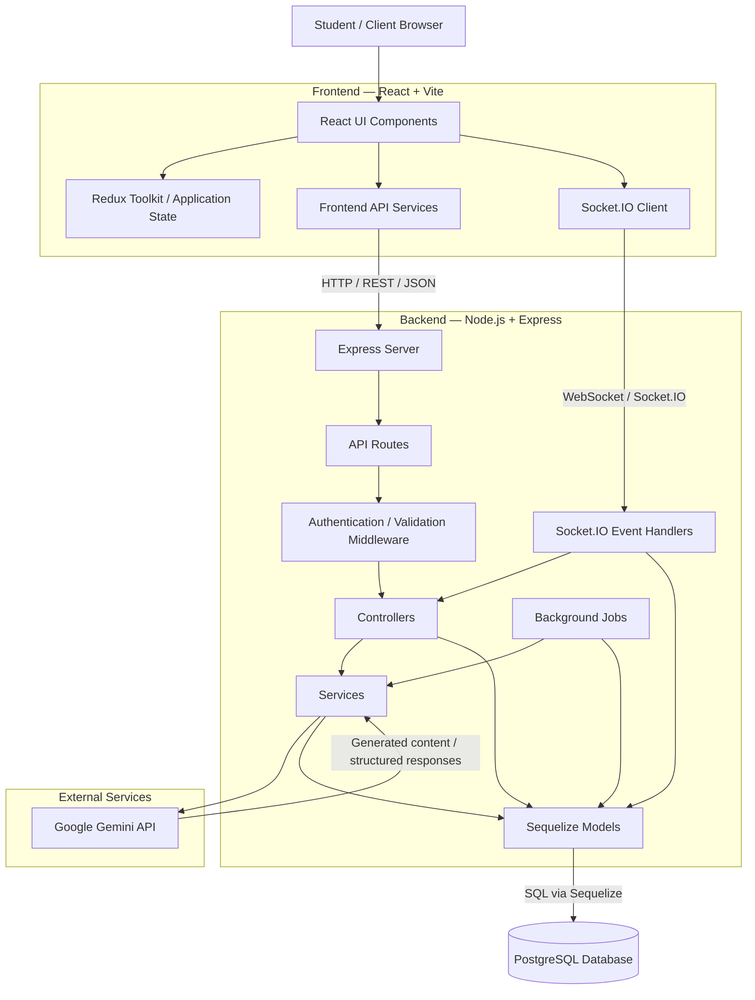
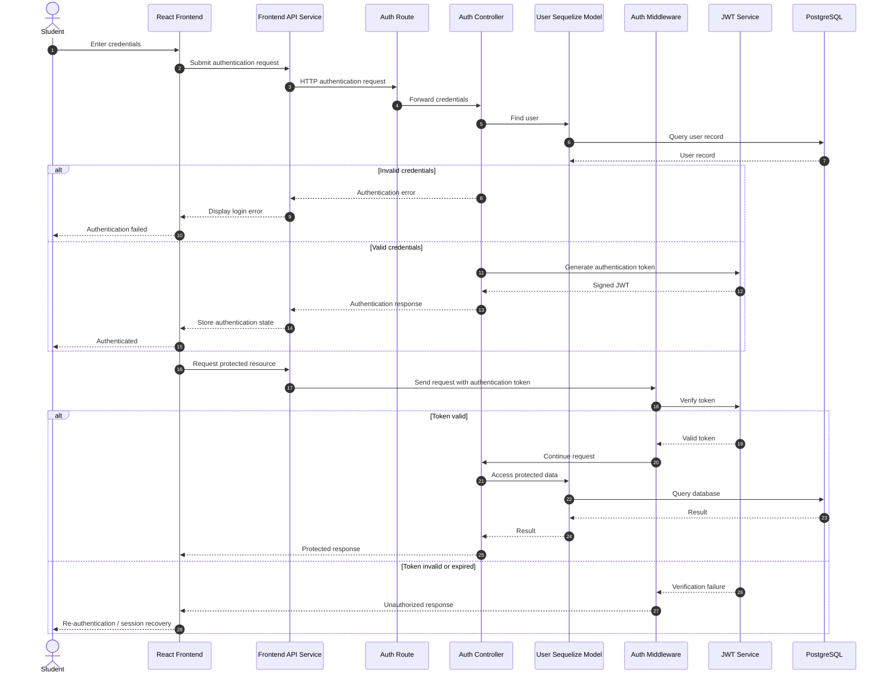
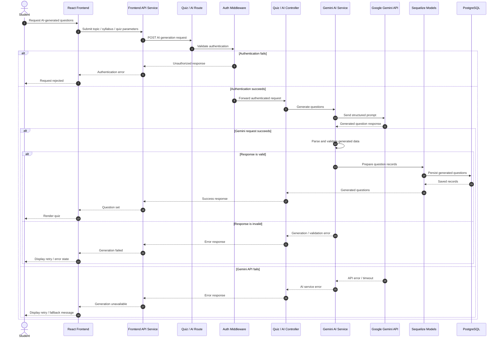
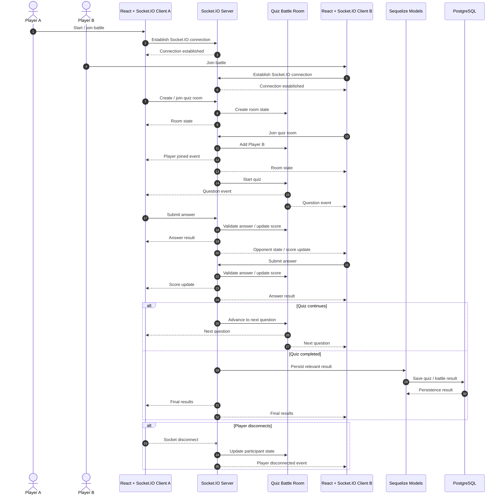
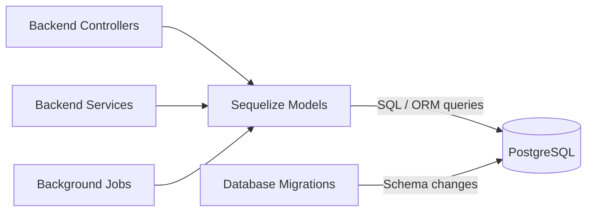
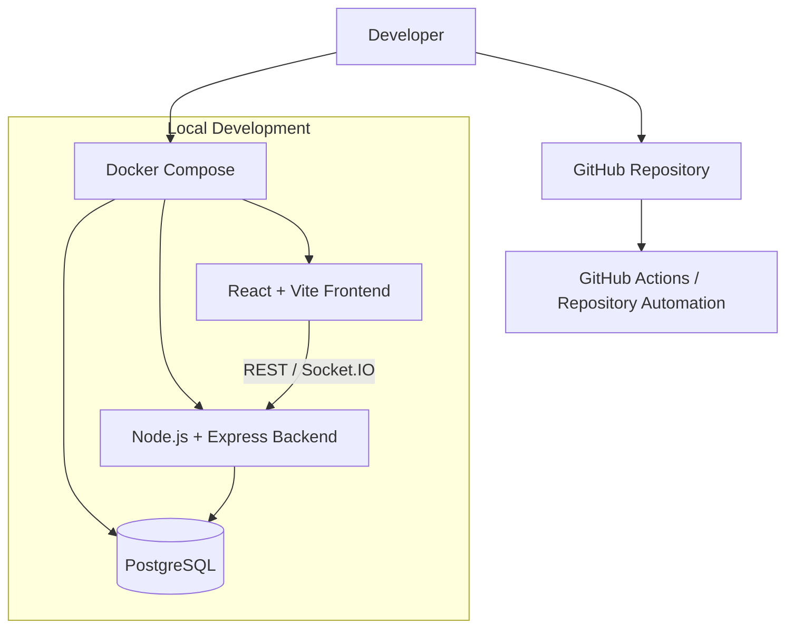

# 🏛️ OpenPrep AI — System Architecture

This document describes the architecture, major components, and core data flows of **OpenPrep AI**. It is intended to help contributors understand how the React frontend communicates with the Express backend, database, Gemini AI service, and real-time Socket.IO layer.

---

## 🔍 System Architecture Overview

OpenPrep AI follows a decoupled, multi-tier architecture:

* **Frontend:** React + Vite + Tailwind CSS
* **Backend:** Node.js + Express.js REST API
* **Authentication:** JWT-based authentication and protected middleware
* **Database:** PostgreSQL accessed through Sequelize ORM
* **AI Integration:** Google Gemini through the backend service layer
* **Real-time communication:** Socket.IO
* **Background processing:** Backend jobs and scheduled tasks
* **Infrastructure:** Docker / Docker Compose and repository automation

### Architecture Diagram



### Accessibility Description

The React frontend is the primary client. It communicates with the Express backend through REST APIs and communicates with the Socket.IO server for real-time features. Express routes pass requests through authentication and validation middleware before reaching controllers. Controllers and services interact with Sequelize models, which persist data in PostgreSQL. AI-related services communicate with Google Gemini. Background jobs use the same backend services and database layer.

---

# 🔐 Authentication and JWT Flow

Authentication is handled by the backend authentication layer and protected middleware. The frontend sends authentication credentials or tokens through the API service layer. Protected requests are checked before reaching application controllers.

> **Implementation note:** The sequence below describes the authentication lifecycle without assuming a specific refresh endpoint name. The exact route and token-storage mechanism should remain aligned with the active authentication implementation.



### Accessibility Description

A user authenticates through the React frontend. The request reaches the authentication route and controller, which retrieves the user through the Sequelize model and database. On successful authentication, a JWT is generated and returned to the frontend. Protected requests pass through authentication middleware, which verifies the token before allowing the request to continue. Invalid or expired authentication results in an unauthorized response.

---

# 🤖 Gemini AI Question Generation Flow

AI-generated questions are requested by the frontend and processed by the backend. Keeping Gemini communication inside the backend service layer prevents the frontend from directly handling the Gemini API credentials.



### Accessibility Description

The frontend sends quiz-generation parameters to the backend. Authentication middleware verifies the request before the controller invokes the Gemini service. The service sends a structured prompt to Gemini and validates the response. Valid questions can be persisted through Sequelize and PostgreSQL before being returned to the frontend. Authentication failures, invalid AI responses, API failures, and timeouts are returned as error states rather than exposing Gemini credentials to the client.

---

# ⚡ Real-time Quiz Battle — Socket.IO Flow

Socket.IO provides real-time communication for multiplayer quiz or study-battle functionality. Unlike normal REST requests, clients maintain a real-time connection and receive events from the server as the shared quiz state changes.



### Accessibility Description

Players connect to the Socket.IO server and join a shared quiz room. The server maintains the room state and broadcasts questions and state changes to connected clients. Players submit answers through Socket.IO events. The server updates the shared state and sends score or answer results to the participants. When the quiz ends, relevant results can be persisted through the Sequelize and PostgreSQL layers. Disconnect events update the remaining participants.

---

# 🗄️ Database Architecture

OpenPrep AI uses PostgreSQL as its persistent data store and Sequelize as the ORM layer. Database access should occur through Sequelize models rather than directly from the React frontend.

The repository contains database models and migrations under:

```text
backend/
├── migrations/
└── models/
```

The following diagram provides the architecture-level relationship between the application and database layer.

> **Note:** Entity names and relationships should be kept synchronized with the active Sequelize models and migrations. When adding or changing a model, update this diagram in the same documentation change.



### Accessibility Description

Controllers, services, and background jobs use Sequelize models to access persistent data. Sequelize translates model operations into database queries against PostgreSQL. Migration files define and evolve the PostgreSQL schema.

---

# 🚀 Deployment Architecture

The repository includes Docker and Docker Compose configuration for local and reproducible service environments.



### Accessibility Description

Developers work with the GitHub repository and can use Docker Compose to run the frontend, backend, and PostgreSQL services locally. GitHub Actions provides repository automation. The frontend communicates with the backend through REST APIs and Socket.IO, while the backend communicates with PostgreSQL.

---

# 📁 Repository Architecture

```text
OpenPrep-AI/
├── .github/                    # GitHub Actions and repository automation
│
├── backend/                    # Node.js + Express backend
│   ├── config/                 # Application and database configuration
│   ├── controllers/            # Request and business logic controllers
│   ├── jobs/                   # Background and scheduled jobs
│   ├── middleware/             # Authentication, validation and request middleware
│   ├── migrations/             # Database migration files
│   ├── models/                 # Sequelize database models
│   ├── routes/                 # Express API route definitions
│   ├── scripts/                # Backend utility and maintenance scripts
│   ├── services/               # External services and AI integrations
│   ├── sockets/                # Socket.IO event handling
│   ├── tests/                  # Backend test suites
│   └── utils/                  # Shared backend utilities
│
├── frontend/                   # React + Vite frontend
│   ├── e2e/                    # End-to-end tests
│   ├── public/                 # Static assets
│   └── src/                    # Frontend source code
│
├── docs/                       # Project documentation
│   └── adr/                    # Architecture Decision Records
│
├── issues/                     # Issue-related resources
├── pr/                         # Pull-request resources
├── scripts/                    # Repository-level automation
│
├── docker-compose.yml          # Local Docker service configuration
├── package.json                # Root project scripts and dependencies
├── pnpm-workspace.yaml         # pnpm workspace configuration
├── CONTRIBUTING.md             # Contribution guidelines
├── CODE_OF_CONDUCT.md          # Community guidelines
├── SECURITY.md                 # Security policy
├── ROADMAP.md                  # Project roadmap
├── CHANGELOG.md                # Project change history
└── README.md                   # Project overview
```

---

# 🔗 Related Documentation

For contribution and development information, see:

* `CONTRIBUTING.md` — contribution workflow and development guidelines
* `SECURITY.md` — security practices and vulnerability reporting
* `docs/adr/` — architecture decisions and their rationale
* `README.md` — project overview, setup, and usage

The architecture documentation should be updated whenever a major backend service, frontend integration, database relationship, authentication mechanism, or real-time communication flow changes.

---

# 📝 Documentation Guidelines for Contributors

When modifying the architecture:

1. Keep Mermaid diagrams compatible with GitHub Markdown.
2. Use descriptive labels that correspond to repository modules.
3. Do not include API keys, credentials, tokens, private URLs, or other secrets.
4. Update diagrams when introducing new services or major data flows.
5. Keep a text-based accessibility description alongside each visual diagram.
6. Verify Mermaid rendering in GitHub or a compatible Markdown previewer before submitting documentation changes.
7. Prefer documenting actual application flows over hypothetical or future architecture.
