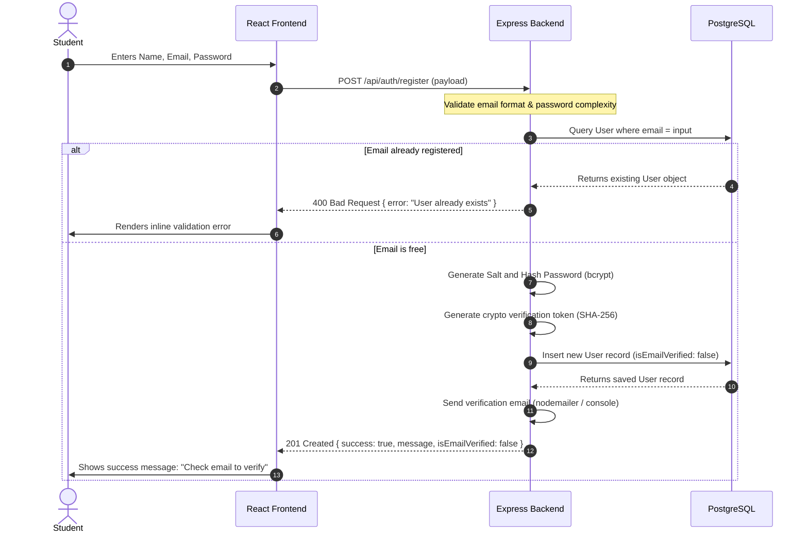
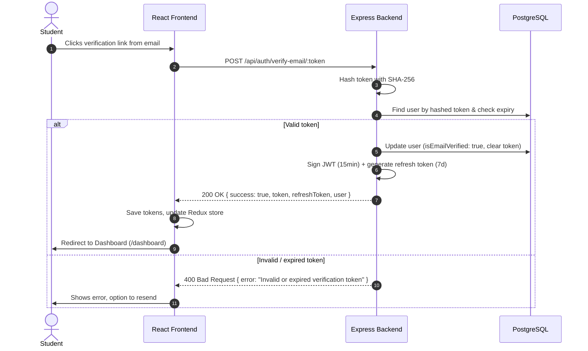
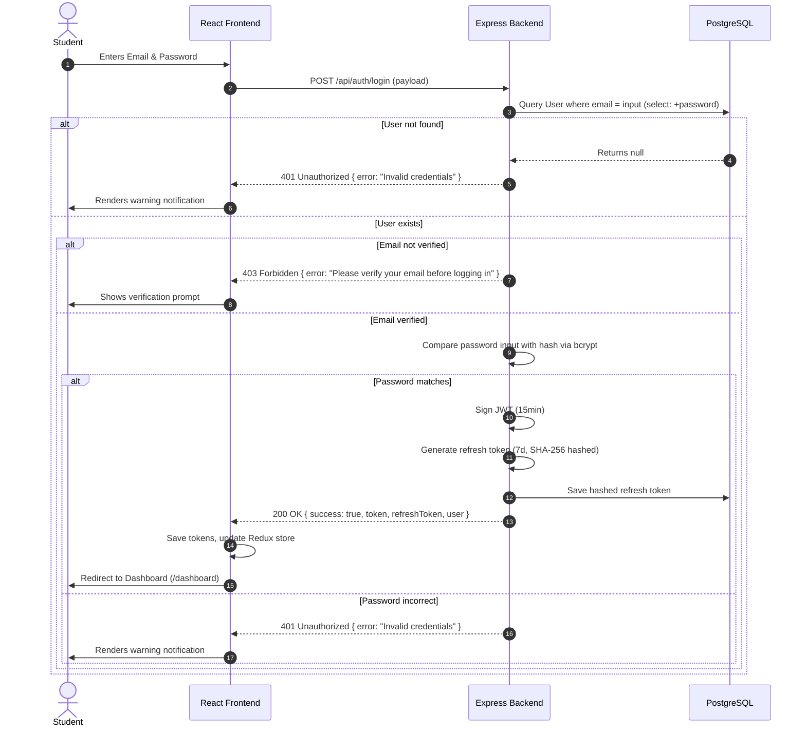
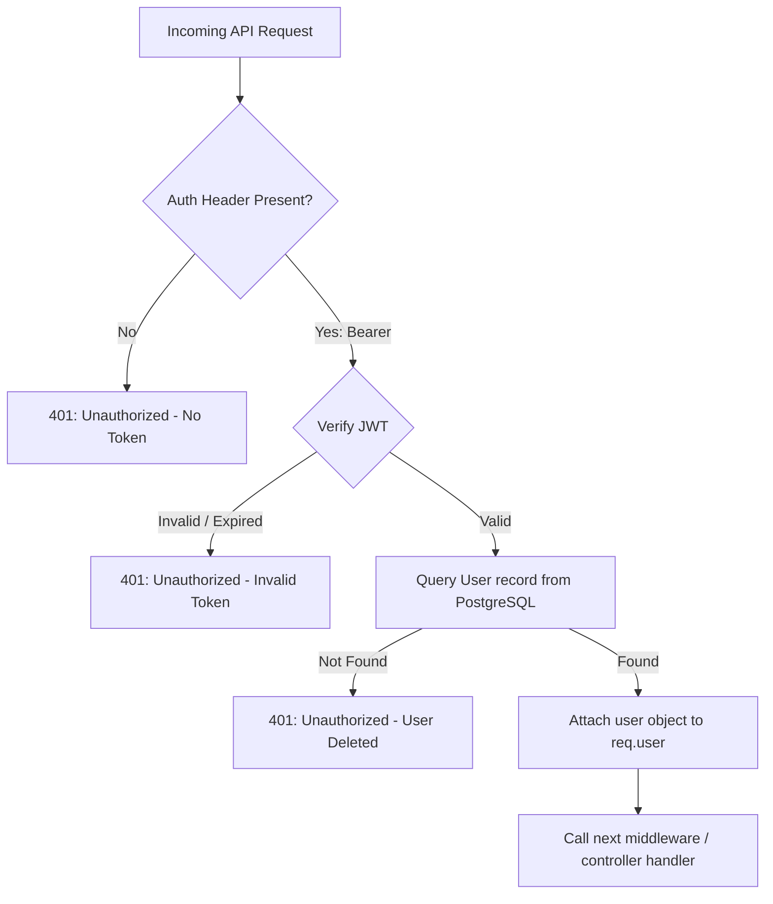
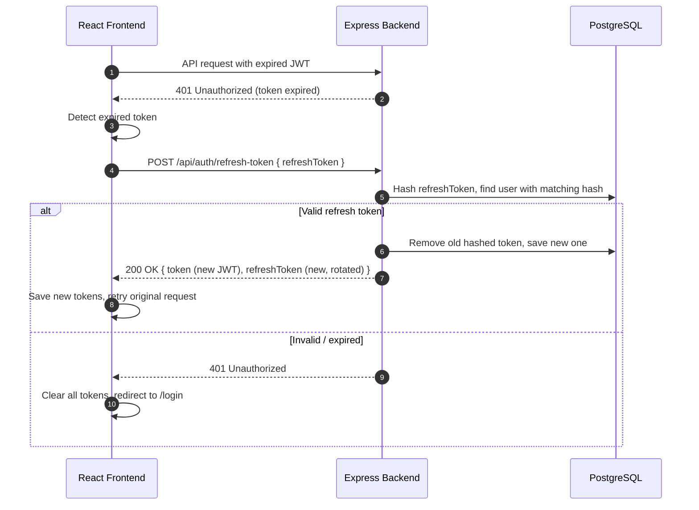

# 🔑 Authentication Flow

This document details the security and authentication flows implemented in **OpenPrep AI**.

---

## 🔒 JWT Security Strategy

OpenPrep AI uses a **dual-token authentication strategy** with short-lived access tokens and long-lived refresh tokens.

### Access Token (JWT)
* **Hashing Algorithm**: `HMAC-SHA256` via the `jsonwebtoken` package.
* **Token Lifetime**: 15 minutes (configured via `JWT_EXPIRE` env variable).
* **Storage Location**: Client `localStorage` under the key `token`.
* **Payload Structure**:
```json
{
  "id": "60d0fe4f5311236168a109a1",
  "iat": 1782059349,
  "exp": 1782059949
}
```

### Refresh Token (Crypto-Random)
* **Generation**: `crypto.randomBytes(32).toString('hex')` — 64-character hex string.
* **Storage**: SHA-256 hash stored in the User record's `refreshTokens` array (supports multi-device login).
* **Token Lifetime**: 7 days.
* **Rotation**: Every refresh invalidates the old token and issues a new pair.
* **Invalidation**: Password reset clears all existing refresh tokens.

---

## 🔄 User Registration Flow

The registration flow establishes new user accounts, hashes credentials, and **requires email verification** before the first login:



### Email Verification Flow



---

## 🔄 User Login Flow



---

## 🛡️ Route Protection Flow (API & UI)

### 1. API Route Guards (Backend)
Private Express routes are chained through the `protect` middleware:

```javascript
// backend/routes/quizRoutes.js
router.post('/generate-ai', protect, generateAIQuiz);
```



### 2. UI Route Guards (Frontend)
Private pages are shielded from guest access using [ProtectedRoute.jsx](file:///c:/Users/Nishit/OneDrive/Desktop/ALL%20Projects/OPENPREP%20AI/OpenPrep-AI/frontend/src/components/ProtectedRoute.jsx).
1. Upon browser load/refresh, the client dispatches the `loadUser` async thunk.
2. If `localStorage.getItem('token')` is set:
   * It sends a `GET /api/auth/me` request with the token.
   * If the request is successful, the Redux store is populated with `user` data and `isAuthenticated` becomes `true`.
   * If the request fails (e.g., token expired), the client should use the refresh token (`localStorage.getItem('refreshToken')`) to call `POST /api/auth/refresh-token` before retrying.
   * If both tokens are expired, it clears local storage, resets Redux state, and redirects to `/login`.
3. If no token is found, accessing protected paths redirects immediately to `/login`.

### 3. Token Refresh Flow

