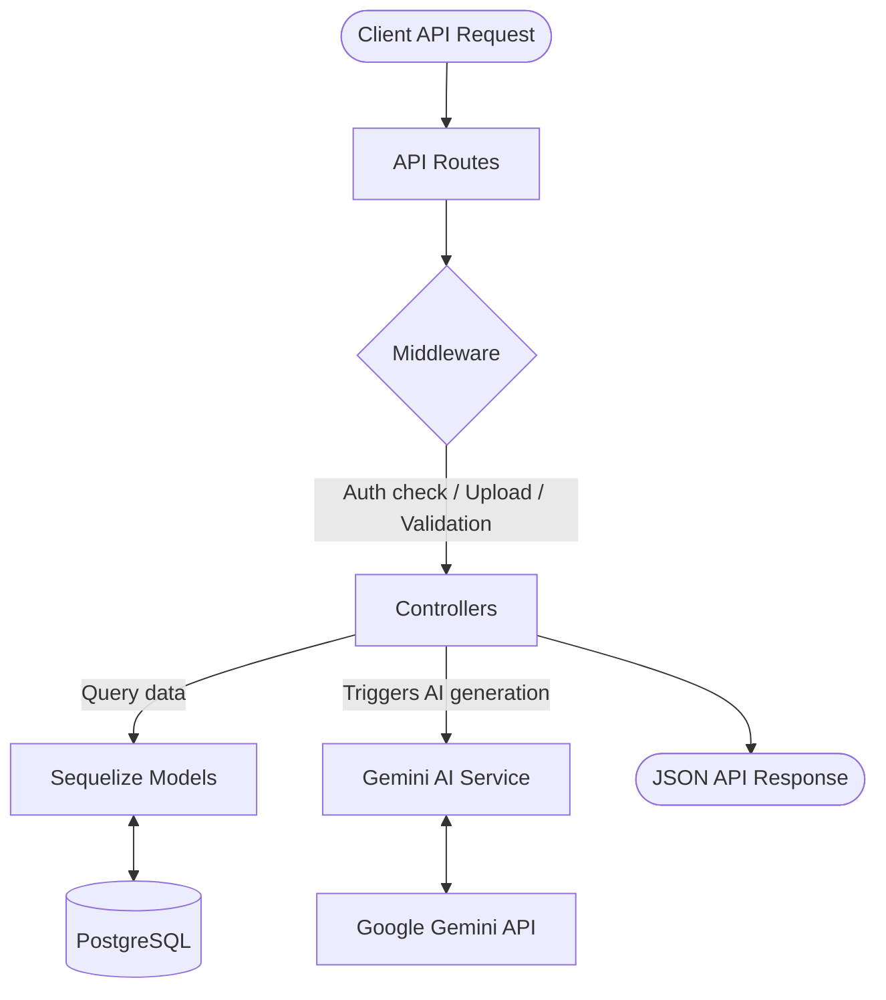

# ⚙️ Backend Architecture

The **OpenPrep AI** backend is built on a clean, scalable Model-View-Controller (MVC) architectural pattern using **Node.js** and **Express.js**.

---

## 🏛️ Architecture Blueprint

The backend decouples request routing, input validation, core business logic, database queries, and AI generation:



---

## 📂 Backend Structure Details

```bash
backend/
├── config/              # Centralized environment configurations (e.g., db.js)
├── controllers/         # Handles HTTP requests, extracts parameters, coordinates responses
├── middleware/          # Authentication checks, file upload processing, global error handling
├── models/              # Sequelize model definitions for PostgreSQL tables
├── routes/              # Express Router mapping paths to appropriate controllers
├── services/            # Custom business services (specifically Gemini AI API interactions)
└── server.js            # Entry point establishing DB connection, middleware pipelines, and port listening
```

---

## 🚦 Middleware Pipeline

Express middlewares intercept incoming HTTP requests to validate and format parameters before they reach core controller logic:

### 1. Authentication Middleware (`middleware/auth.js`)
* Extracts the Bearer Token from the request header: `Authorization: Bearer <token>`.
* Verifies the token using `jsonwebtoken` and the `JWT_SECRET`.
* Finds the user record in PostgreSQL and appends it to the request context (`req.user`) or rejects the request with a `401 Unauthorized` response.

### 2. Upload Middleware (`middleware/upload.js`)
* Uses `multer` to handle multi-part form data uploads for PYQ PDFs or lecture notes.
* Validates file size constraints and file formats (restricting inputs strictly to PDFs).

### 3. Global Error Handler (`middleware/error.js`)
* Catches unhandled promise rejections.
* Formats error payloads to ensure the client receives a structured response (e.g., `{ error: "Error details here" }`).

---

## 🧠 Service Layer: AI Integration (`services/geminiService.js`)

Heavy business logic and external LLM APIs are kept out of controllers and isolated in the `services/` directory:
* **Gemini Client**: Initialized using the `@google/generative-ai` SDK.
* **Model Selection**: Uses `gemini-1.5-flash` for high-speed, cost-effective prompt completions.
* **JSON Integrity**: Integrates strict JSON formatting constraints in prompts, utilizing helper parsers to clean Markdown backticks and safely parse response arrays or nested objects.
* **Mock Failbacks**: Implements local mock data generators. If the `GEMINI_API_KEY` is not present, the service logs a warning and returns pre-structured mock objects so developers can test the application offline.
